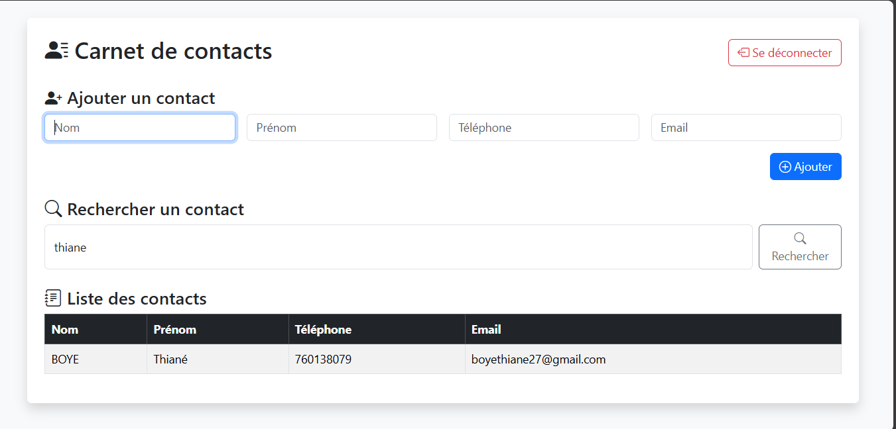
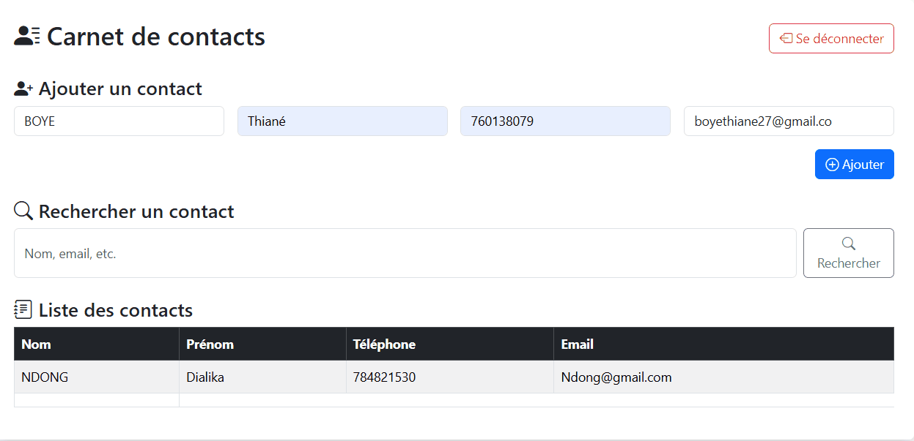

---

## 📁 Titre : Projet 03 – Carnet de contacts (PHP)

### 📝 Description :
Petite application web permettant d’ajouter, enregistrer, rechercher et afficher des contacts via un formulaire. Les données sont sauvegardées dans un fichier CSV. Accès sécurisé par session PHP.

### 🖼️ Image :

### 🎞️ GIF démonstration :

### git Vidéo  :
📽️ [Lien vers la vidéo sur Drive ou GitHub](https://drive.google.com/file/d/1VPycnr_-QGYREs6VeASDIEJjohVImyRC/view?usp=sharing)

###  Lien GitHub :
🔗 [github.com/tbyb/carnet-contacts-php](https://github.com/Tbyb/03-carnet-contacts)

### 🛠️ Technologies utilisées :
- PHP
- HTML 
- Bootstrap
- CSV
